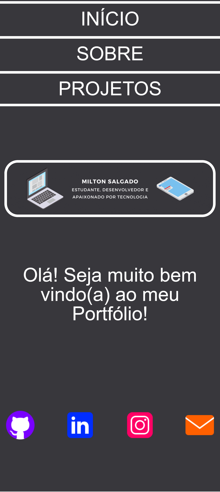

# 💼 Portfolio

Um portfolio de projetos, feito com a biblioteca React JavaScript.

## 📚 Tabela de Conteúdos

- [💼 Portfolio](#-portfolio)
  - [📚 Tabela de Conteúdos](#-tabela-de-conteúdos)
  - [📋 Descrição](#-descrição)
    - [🚀 Funcionalidades](#-funcionalidades)
    - [🌐 Acesso](#-acesso)
    - [📸 Prévia](#-prévia)
  - [⚙️ Construção](#️-construção)
    - [💻 Tecnologias](#-tecnologias)
    - [🛠️ Ferramentas](#️-ferramentas)
    - [📌 Versão](#-versão)
  - [✏️ Aprendizado](#️-aprendizado)
  - [✒️ Autores](#️-autores)
  - [🎁 Agradecimentos](#-agradecimentos)
  - [📨 Contato](#-contato)

## 📋 Descrição

Este é um projeto de um portfólio.
Esse projeto foi lançado como o desafio 04 do módulo 02 do curso de front-end do "Vai na Web".
Esse também foi o desafio final do curso, e portanto, é o marco do fim de um ciclo de aprendizado, conectividade e aplicabilidade em front-end para mim.
Sua principal proposta era colocar todos os conhecimentos adquiridos ao longo do curso, como HTML5.
Um modelo de exemplo foi apresentado na plataforma de design "Figma".

### 🚀 Funcionalidades

As funcionalidades disponíveis para os usuários estão listadas abaixo:

- Conhecer um pouco da minha história como desenvolvedor
- Acessar meus projetos em tempo real e seus respectivos repositórios no GitHub
- Me contactar através das minhas redes sociais, e-mail e perfil no GitHub
- Calcular o quadrado de um valor numérico

### 🌐 Acesso

🖇️ [Clique aqui para acessar o projeto](https://milton-salgado.github.io/portfolio-milton-salgado/)

### 📸 Prévia

  
  

## ⚙️ Construção

Resumo geral dos recursos utilizados na construção do projeto.

### 💻 Tecnologias

Tecnologias utilizadas na construção do projeto:

### 🛠️ Ferramentas

Ferramentas utilizadas na construção do projeto:

### 📌 Versão

Utilizei o Git para o controle de versão. 

Versão atual: 1.0 (primeira versão)

## ✏️ Aprendizado

Ao fazer esse projeto, aprendi a:

- Construir um projeto completo utilizando React JavaScript
- Revisitar a semântica com HTML5
- Retomar as práticas de responsividade com CSS3
- Fixar estruturas de dados como arrays e objetos em JavaScript
- Fazer funções do zero na linguagem JavaScript
- Consolidar o uso de métodos como o "map" e o "find" da linguagem JavaScript
- Manipular rotas com o "React Router DOM" na biblioteva React JavaScript 
- Revisar todos os conceitos aprendidos ao longo da minha formação no "Vai na Web"
- Criar um portfólio simples, eficiente e completo utilizando a biblioteca React JavaScript

## ✒️ Autores

* **Milton Salgado Leandro** - *Todo o Projeto* - [GitHub](https://github.com/milton-salgado)

## 🎁 Agradecimentos

* Agradeço ao instrutor João Pedro Belo e aos facilitadores Merry Esperança e Naiara Souza pelo auxílio no meu processo de aprendizagem e apoio na construção do projeto.
* Agradeço também a você, visitante, por visualizar o meu projeto!

## 📨 Contato

